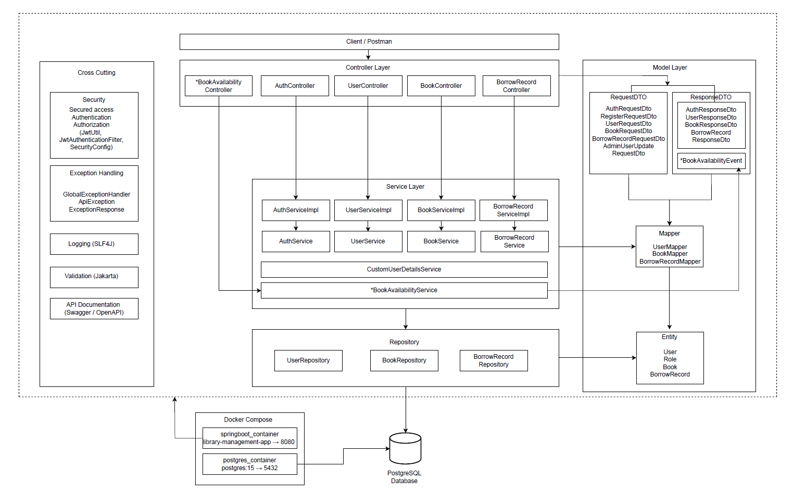
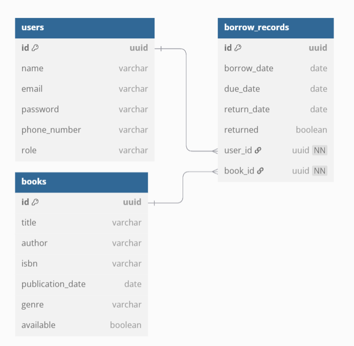

# 📚 Library Management System

A robust and modern Library Management System built with Java 21 and Spring Boot. This monolithic application supports essential library operations for both **librarians** and **patrons**, including book management, user handling, borrowing and returning books and real-time availability tracking via reactive streams.

## 📄 Detailed Documentation

For full project explanation, architecture and screenshots, please refer to the PDF below:

📥 [Download Detailed Documentation (PDF)](https://raw.githubusercontent.com/sirdashasan/library-management/main/docs/LibraryDocumentation.pdf)

## 🚀 Features

- ✅ Role-based Access Control (Librarian vs Patron)
- 🔐 JWT Authentication and Authorization
- 📚 Book Borrowing & Returning
- 📅 Overdue Record Tracking
- 🔁 Real-time Book Availability Updates (WebFlux + SSE)
- 🧪 Unit & Integration Testing with JUnit and Mockito
- 🐳 Dockerized for easy deployment
- 📄 API Documentation with Swagger (OpenAPI 3)

## 🛠️ Technologies Used
- **Languages & Frameworks**: Java 21, Spring Boot, Spring MVC, Spring Data JPA, Spring Security, Spring WebFlux
- **Security**: JWT, BCrypt, Role-Based Access Control
- **Database**: PostgreSQL, H2 (for testing)
- **Documentation**: Swagger UI (OpenAPI 3)
- **Testing**: JUnit 5, Mockito, Reactor Test, Spring Security Test
- **Build Tool**: Maven
- **Utilities**: Lombok, dotenv-java
- **Frontend (Demo)**: React, JavaScript, Context API, Axios, Tailwind CSS  
    [GitHub Repository](https://github.com/sirdashasan/library-frontend)


## 🐳 Installation & Running

```bash
# 1. Clone the repository
git clone https://github.com/sirdashasan/library-management.git

# 2. Build the project
mvn clean package -DskipTests

# 3. Run with Docker Compose
docker-compose up --build

```

## ⚙️ Configuration

### Main config files:

- `application.properties`: Core settings like server port, DB connection, Swagger, JWT, etc.
- `application.properties (test)`: Used for integration testing with in-memory H2 and a separate JWT secret.
- `.env`: Securely stores `DB_USERNAME`, `DB_PASSWORD`, `JWT_SECRET` and injected via Docker Compose.

---

### 📌 Access Points after startup:

- 🔗 API Root: `http://localhost:8080/library/api`
- 🔗 Swagger UI: `http://localhost:8080/library/api/swagger-ui/index.html`
- 🔗 Book Availability Stream (SSE): `http://localhost:8080/library/api/books/availability-stream`


## 🧱 System Architecture

The following diagram illustrates the layered architecture of the Library Management System:



## 🗃️ Database Schema

The diagram below shows the relational structure between users, books, and borrow records:



### 🔗 Entity Relationships

- One **User** ⟶ Many **BorrowRecords**  
  (A user can borrow multiple books)

- One **Book** ⟶ Many **BorrowRecords**  
  (A book can be borrowed multiple times by different users)

- Each **BorrowRecord** contains:
    - `user_id` → references `users.id`
    - `book_id` → references `books.id`

## ✅ 📋 Feature Access Matrix

| Feature                             | Librarian | Patron | Endpoint                             | Module          |
| ----------------------------------- | --------- | ------ | ------------------------------------ | --------------- |
| View all users                      | ✅         | ❌      | `GET /users`                         | User            |
| View user by ID                     | ✅         | ❌      | `GET /users/{id}`                    | User            |
| View own user details               | ✅         | ✅      | `GET /users/me`                      | User            |
| Register                            | ✅         | ✅      | `POST /auth/register`                | User            |
| Login                               | ✅         | ✅      | `POST /auth/login`                   | User            |
| Update any user                     | ✅         | ❌      | `PUT /users/{id}`                    | User            |
| Delete a user                       | ✅         | ❌      | `DELETE /users/{id}`                 | User            |
|                                     |           |        |                                      |                 |
| View book list & details            | ✅         | ✅      | `GET /books`                         | Book            |
| Search books by ID                  | ✅         | ✅      | `GET /books/{id}`                    | Book            |
| Search books by title (pagination)  | ✅         | ✅      | `GET /books/search/title`            | Book            |
| Search books by author (pagination) | ✅         | ✅      | `GET /books/search/author`           | Book            |
| Search books by ISBN (pagination)   | ✅         | ✅      | `GET /books/search/isbn`             | Book            |
| Search books by genre (pagination)  | ✅         | ✅      | `GET /books/search/genre`            | Book            |
| Add a book                          | ✅         | ❌      | `POST /books`                        | Book            |
| Update a book                       | ✅         | ❌      | `PUT /books/{id}`                    | Book            |
| Delete a book                       | ✅         | ❌      | `DELETE /books/{id}`                 | Book            |
|                                     |           |        |                                      |                 |
| View all borrow histories           | ✅         | ❌      | `GET /borrow-records`                | Borrow Record   |
| View borrow record by user ID       | ✅         | ❌      | `GET /borrow-records/user/{userId}`  | Borrow Record   |
| View own borrow records             | ✅         | ✅      | `GET /borrow-records/me`             | Borrow Record   |
| View overdue records                | ✅         | ❌      | `GET /borrow-records/overdue`        | Borrow Record   |
| Borrow a book                       | ✅         | ✅      | `POST /borrow-records`               | Borrow Record   |
| Return a book                       | ✅         | ✅      | `PUT /borrow-records/return/{id}`    | Borrow Record   |
| Report overdue                      | ✅         | ❌      | `GET /borrow-records/overdue/report` | Borrow Record   |
| Book availability stream            | ✅         | ✅      | `GET /books/availability-stream`     | Book (Reactive) |

## 🧪 Postman Collection

You can test all API endpoints using the provided Postman Collection:

📥 [Download Collection](docs/library-management.postman_collection.json)